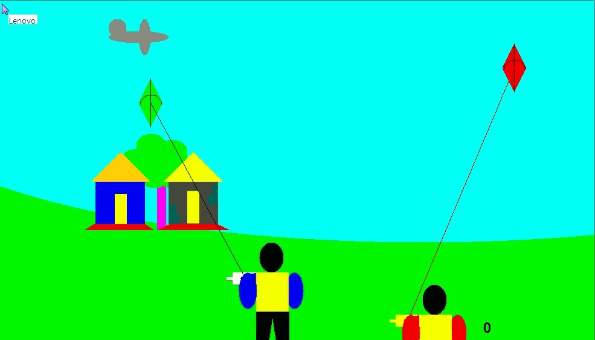

<!-- TABLE OF CONTENTS -->
## Table of Contents

* [About the Project](#about-the-project)
  * [Built With](#built-with)
* [Getting Started](#getting-started)
  * [Prerequisites](#prerequisites)
  * [Installation](#installation)
* [Usage](#usage)
* [Contributing](#contributing)
* [License](#license)
* [Contact](#contact)
* [Acknowledgements](#acknowledgements)

<!-- ABOUT THE PROJECT -->
## About The Project

This is a Java Applet based Game for two players. It's basically a kite game with lots of adventures and fun.

### Built With
* [Bootstrap](https://getbootstrap.com)
* [JQuery](https://jquery.com)
* [Laravel](https://laravel.com)

<!-- GETTING STARTED -->
### Game Logic & Instructions

press c button to take the control of right kite and use the arrow keys to move it right,left, up and down...

<!-- LICENSE -->
### License

Distributed under the MIT License. See `LICENSE` for more information.

<!-- CONTACT -->
### Contact

Your Name - [@abdullahal007](https://www.facebook.com/abdullahal007) - Abdullah Al Arif

Project Link: [https://github.com//Abdullahalarif/kite-game.git](https://github.com//Abdullahalarif/kite-game.git)
